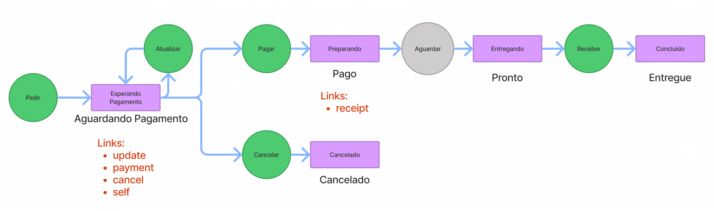

# Exemplo

|Acao|Verbo|Url|Logica de negocio|Status code|Status Error|Hyperlinks|
|Pedir|POST|/order|Criar um novo pedido|201|-|self,update,cancel,payment|
|Atualizar|PUT|/order/42|Atualiza o pedido, se somente se o status for "Aguardando Pagamento"|200|409|self,update,cancel,payment|
|Cancelar|DELETE|/order/42|Atualiza o pedido para o status Cancelado, se somente se o status for "Aguardando Pagamento|204|409|-|
|Pagar|PUT|/payment/42|Realiza o pagamento e no sucesso atualiza o status para Pago, se e somente se o status for "Aguardando Pagamento"|200|409,422|self,receipt|
|Aguardar|-|-|Um funcionario prepara o pedido|-|-| |
|Receber|DELETE|/receipt/42|Confirma o recebimento atualizando o status para "Entregue", se e somente se o status for "Pronto"|
|-|GET|/order/42|Retorna a ultima representacao do pedido.|200|-|Depende do status|

